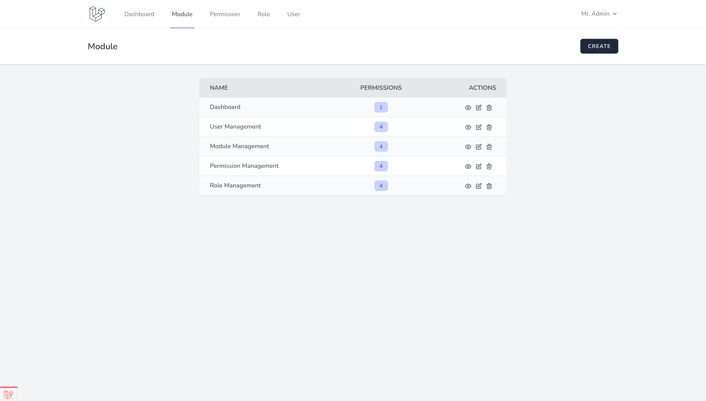
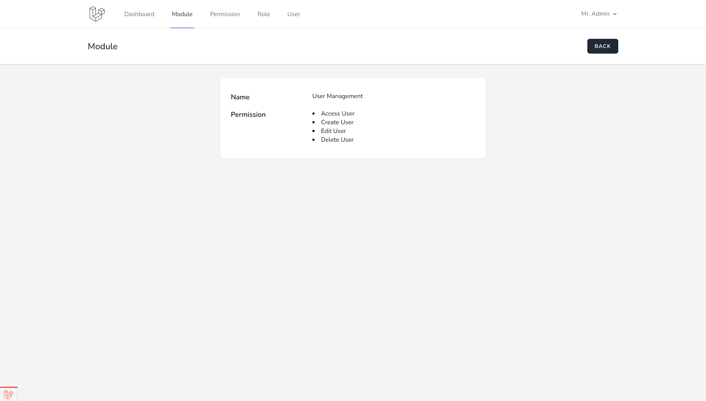
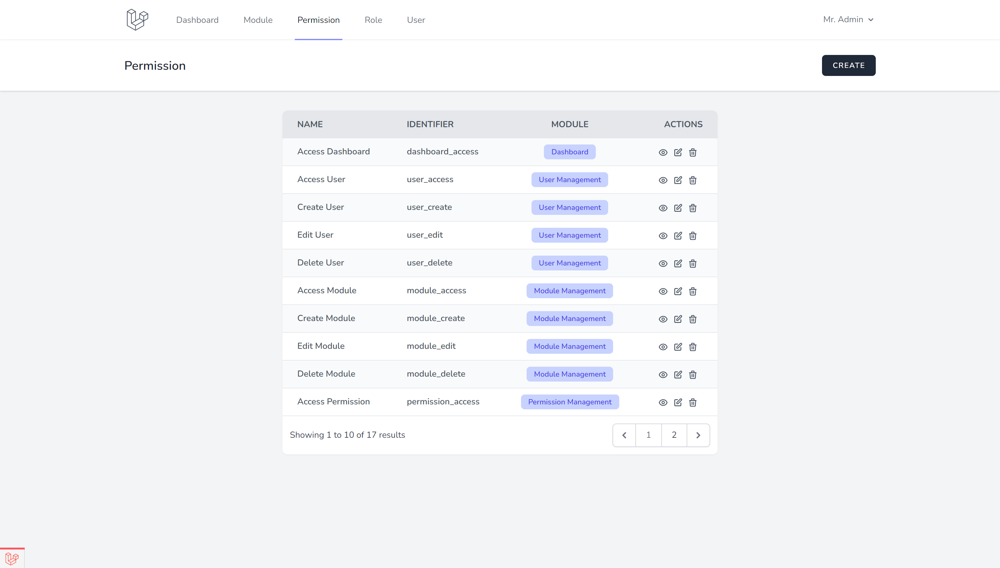
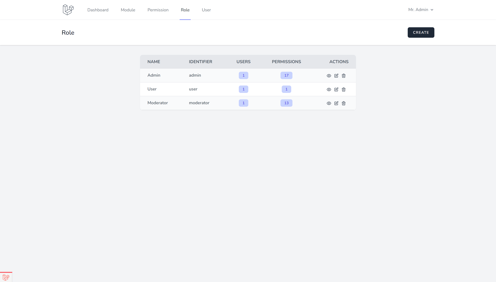
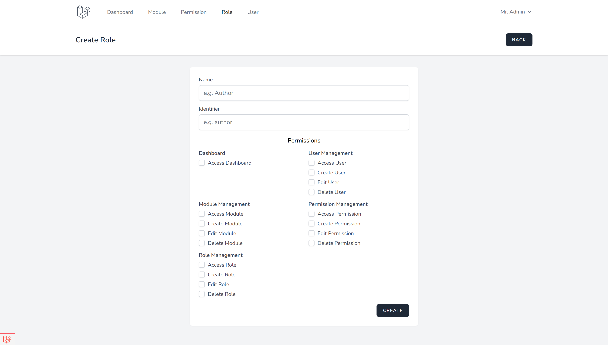
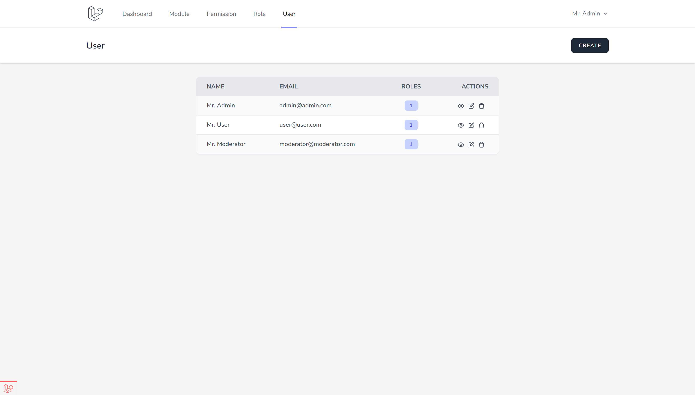

# Laravel Role Permission

A simple laravel project for demonstration purpose. Based on Laravel 8.X with Laravel Breeze.

## Requirements

- Laravel 8.X
- PHP 7.3

## Installation

```
git clone https://github.com/rumyTM/role-permission-breeze.git role-permission-breeze
cd role-permission-breeze
composer install
cp .env.example .env
php artisan key:generate
php artisan migrate
php artisan db:seed
```

## Screenshots

#### Module Index Page


#### Show Module Page


#### Permission Index Page


#### Role Index Page


#### Create Role Page


#### User Index Page

